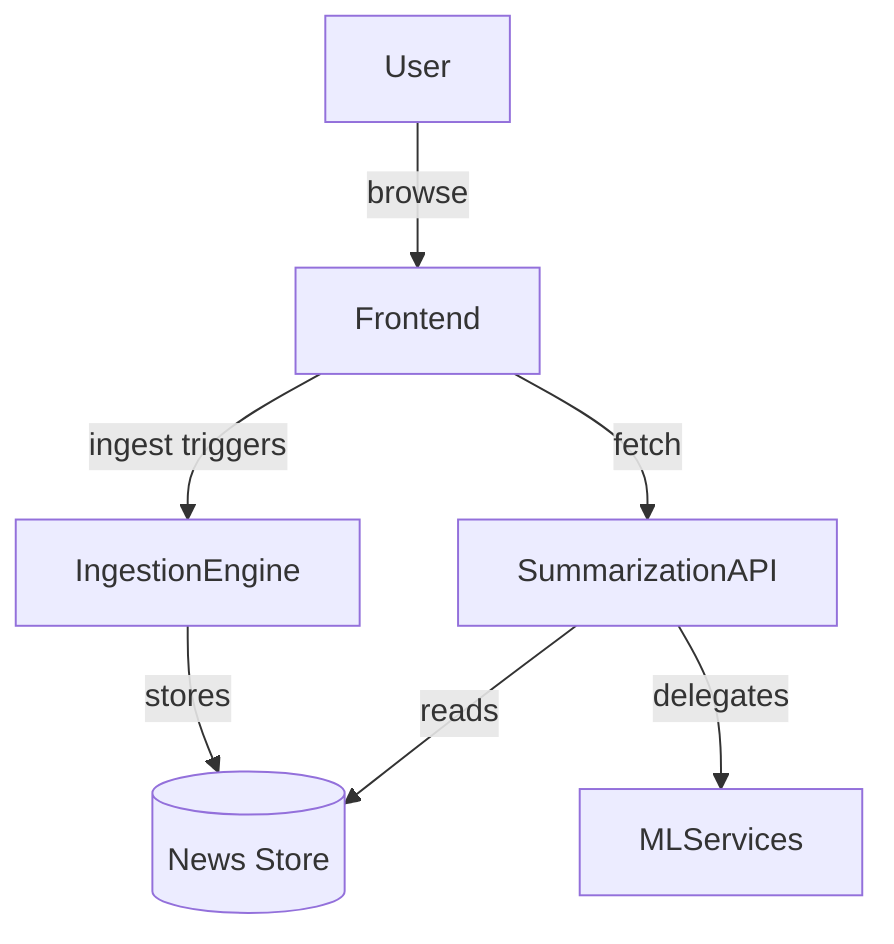
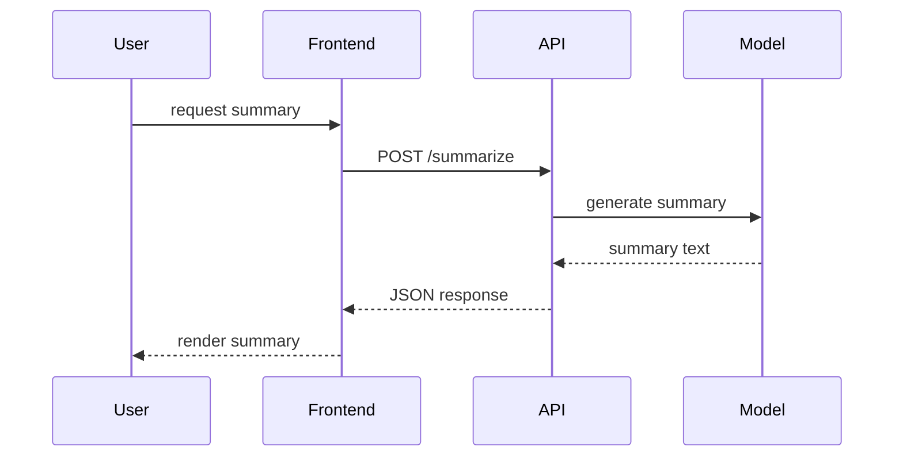

# Architecture

## Component Overview
- **Next.js Frontend** (`app/`, `components/`) serves dashboard UI
- **Ingestion Engine** (`news/ingest.js`) collects and deduplicates articles
- **Summarization API** (`api/openapi.yaml`) exposes `/summarize` endpoints
- **MLOps Services** (`mlops/`) manage training, deployment, and monitoring

## High-Level Diagram

## Summarization Sequence

## Deployment Topology
- Frontend deployed on Vercel or Node server
- Backend and MLOps services containerized via Docker
- Optional Kubernetes manifests under `mlops/kubernetes/`
