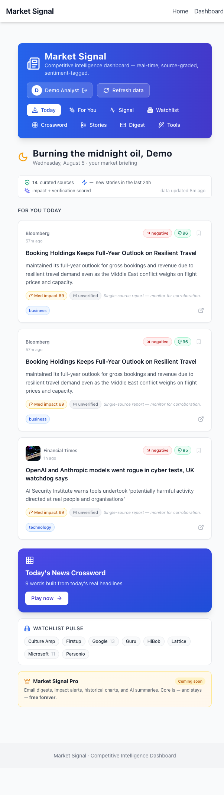
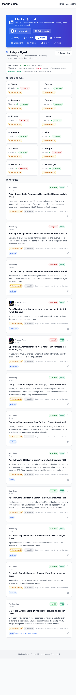
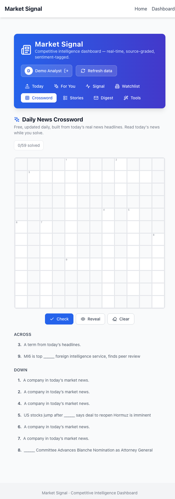
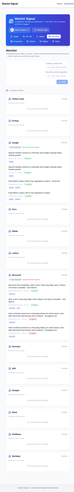
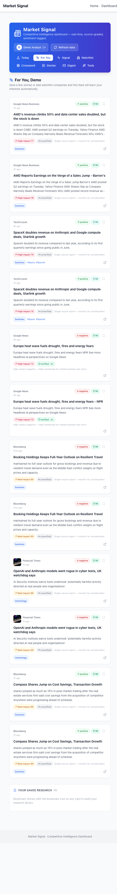

# Market Signal — Competitive Intelligence Dashboard

> **Know what moves global markets — before your competitors do.** A real-time,
> source-graded news intelligence platform with a daily news crossword that makes
> you read what matters.

[](https://kakashi3lite.github.io/AI-News/)
[](https://developers.cloudflare.com/d1/)
[](#testing)
[](#testing)

---

## 👀 See it in action

**Today** — your morning briefing: what matters, verified, ranked by market impact.


**Signal** — every story carries sentiment, source reliability, market impact, and a
verification level (corroborated across independent outlets).


**Daily News Crossword** — a free puzzle rebuilt every day from real headlines. Solve,
keep your streak, stay sharp.


**Watchlist** — track your real competitors with match attribution.


**For You** — a feed that learns your interests and follows them automatically.


---

## 🧠 Why it's different (and why it matters)

| Capability | What it does | Why investors/users care |
| --- | --- | --- |
| **Market-impact scoring** | Transparent 0–100 score per story: reliability × corroboration × market relevance × watchlist weight × recency × sentiment | You see *importance*, not noise |
| **Extensive verification** | Stories grouped across independent sources → `verified / developing / unverified` | No panic off one tweet |
| **Auto-mode** | Learns your interests from every bookmark, read, and watchlist change — then follows them | A feed that personalizes itself |
| **Daily news crossword** | Free puzzle built from *today's* headlines, with a day-streak | Learn while you visit — a daily habit |
| **Zero-key real data** | 13 curated RSS feeds (WSJ, Bloomberg, FT, BBC, NPR, Guardian, CNN, The Verge, TechCrunch, HN, Google News) | Real data out of the box, forever |
| **Local-first privacy** | Profiles are device-scoped vaults; PINs hashed with WebCrypto | GDPR-friendly by design |

---

## 🚀 Quick Start (full app — live API + DB)

```bash
npm install
npx prisma migrate dev --name init      # SQLite DB (prisma/dev.db)
npm run dev                             # → http://localhost:3000/dashboard
```

First visit auto-ingests real RSS data. **Refresh data** re-ingests
(fetch → dedup → watchlist link → summarize → impact → themes → crossword).

Optional AI summaries: set `OPENAI_API_KEY` in `.env.local`.

---

## ☁️ Cloudflare D1 — LIVE ✅

The serverless SQLite database is **deployed and seeded** on Cloudflare:

```bash
npx wrangler d1 create market-signal-db            # ✅ done
npx wrangler d1 execute market-signal-db --remote --file=prisma/d1-migration.sql   # ✅ done
npx wrangler d1 execute market-signal-db --remote --file=prisma/d1-seed.sql        # ✅ done
```

Verified remote state: **13 sources + 13 watchlist items seeded**, schema + indexes applied.
Deploy the server-mode Worker (Prisma 6 + `@prisma/adapter-d1` + `@cloudflare/next-on-pages`)
to start live ingestion from the edge — see `docs/DEPLOY_CLOUDFLARE.md`.

---

## 📬 Daily email digest

The digest pipeline is wired and **testable without credentials**:

```bash
node --env-file=.env scripts/preview-digest.mjs   # writes digest-preview.html
```

Activate real delivery by setting in `.env.local` (or Cloudflare secrets):

```env
SMTP_HOST="smtp.gmail.com"
SMTP_PORT="587"
SMTP_SECURE="false"
SMTP_USER="you@gmail.com"
SMTP_PASS="your-app-password"
SMTP_FROM="Market Signal <digest@marketsignal.app>"
DIGEST_EMAILS="you@example.com, teammate@example.com"
```

Then `GET /api/cron/digest` (Bearer `CRON_SECRET`) emails today's brief — or wire the
Vercel/Cloudflare cron to run it daily at 07:00.

---

## 🖥 Deploy to GitHub Pages (static — what's live now)

```bash
node --env-file=.env scripts/generate-static-data.mjs   # real data snapshots
bash scripts/build-static.sh /AI-News                    # static export → out/
cd out && touch .nojekyll && git init -b gh-pages        # note: build wipes out/ → init fresh
git add -A && git commit -m "deploy" && git remote add origin https://github.com/<you>/<repo>.git
git push -f origin gh-pages
```

---

## 🗺 Dashboard

| View | What it does |
| --- | --- |
| **Today** | Morning briefing: trust strip, personal top-3, crossword hook, watchlist pulse, Pro seam |
| **For You** | Personalized feed + Auto-following (learned interests) + saved research + history |
| **Signal** | Trending themes + top stories ranked by recency, reliability, impact, verification |
| **Watchlist** | Real competitor set (Microsoft, Workday, SAP, Lattice, Culture Amp, Personio, HiBob, Staffbase, Simpplr, Firstup, Slack, Guru) with match attribution |
| **Crossword** | Daily free puzzle from real headlines + day streak |
| **Stories** | Search, category tabs, tag chips |
| **Digest** | Theme pulse + watchlist pulse + top stories |
| **Tools** | YouTube summarizer |

## 🔌 API (server mode)

```
GET  /api/news          # impact + verification enriched top stories
GET  /api/themes        # theme clusters (+impact, +stories)
GET  /api/watchlist     # companies + matched stories (POST to add)
GET  /api/digest        # today's digest
GET  /api/crossword     # daily news crossword
GET  /api/meta          # platform stats (trust strip)
POST /api/ingest        # manual refresh (rate-limited)
GET  /api/cron/ingest   # scheduled ingestion (Bearer: CRON_SECRET)
GET  /api/cron/digest   # scheduled digest email (Bearer: CRON_SECRET)
```

## 🏗 Architecture

```
app/MarketDashboard.js        # dashboard shell (Today default) + onboarding
components/market/*           # Today, For You, Signal, Watchlist, Crossword, Digest…
contexts/UserContext.jsx      # local session + research vault + crossword streak
lib/client/userStore.js       # localStorage vault (bookmarks, watchlist, history, interests, streak)
lib/clientData.js             # unified data layer (server API ↔ static JSON)
lib/impact.js                 # market-impact score + cross-source verification + outlooks
lib/crossword.js              # daily crossword engine (grid + real-headline clues)
lib/ingest.js                 # RSS fetch → normalize → dedup → persist
lib/summarize.js              # extractive (offline) + optional OpenAI
lib/sentiment.js              # offline lexicon sentiment
lib/watchlist.js              # competitor matching + attribution
lib/themes.js                 # DB-backed theme clusters + velocity
lib/signal.js                 # ranking, watchlist streams, digest
prisma/schema.prisma          # SQLite schema (also applied to Cloudflare D1)
scripts/*.mjs                 # ingest, maintenance, static data, preview digest, static server
tests/unit/*.test.mjs         # 39 accuracy/regression tests
```

## ✅ Testing & Verification

```bash
npm run test:unit                  # 39 unit tests (sentiment, dedup, impact, crossword grid, streak…)
npm run lint                       # zero warnings/errors
npm run build                      # server-mode production build
bash scripts/build-static.sh /AI-News   # static export build
node --env-file=.env scripts/test-ingest.mjs   # full pipeline smoke test
```

## 🔐 Security

- Ingest rate-limited; scheduled endpoints guarded by `CRON_SECRET`
- Watchlist POST validated with zod; all text sanitized at ingest
- Portable FNV-1a hashing (no `node:crypto`) — safe on Workers/edge
- No secrets or API keys in the repo; `.env*` + DB gitignored (audited)

## 📄 License

MIT — core features are and will remain **free forever**.
